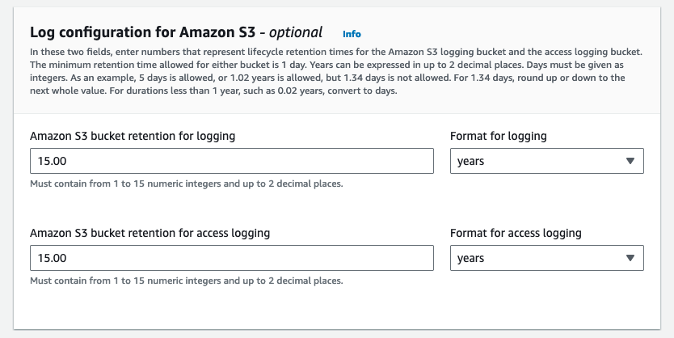

# Enhancing Security and Compliance with AWS Control Tower Landing Zone - Upgrade to Version 3.2

In the world of cloud computing, maintaining robust security and compliance standards is paramount. One of the key tools in achieving this is AWS Control Tower, a powerful service that helps organizations set up and govern a secure, multi-account AWS environment. Recently, AWS Control Tower released version 3.2, introducing critical improvements and changes that align with best practices for enhanced security and compliance. In this blog post, we'll explore these changes, their significance, and why the upgrade to [version 3.2](https://docs.aws.amazon.com/controltower/latest/userguide/2023-all.html#lz-3-2) is essential for organizations using AWS Control Tower.

## The Role Transition

In previous versions of AWS Control Tower Landing Zone, such as version 3.0, the **AWSControlTowerExecution** role played a crucial role in performing operations within member accounts. This role, while functional, had a broad set of permissions, which could potentially introduce security risks. 

Below is AWSControlTowerExection role Policy

```json
{
    "Version": "2012-10-17",
    "Statement": [
        {
            "Effect": "Allow",
            "Action": "*",
            "Resource": "*"
        }
    ]
}
```
and below is the Trust Relationship

```json
{
    "Version": "2012-10-17",
    "Statement": [
        {
            "Effect": "Allow",
            "Principal": {
                "AWS": "arn:aws:iam::<management-account-id>:root"
            },
            "Action": "sts:AssumeRole"
        }
    ]
}
```

## Introducing AWSServiceRoleForAWSControlTower 

With the release of AWS Control Tower Landing Zone version 3.2, a new Service-Linked Role (SLR) named **AWSServiceRoleForAWSControlTower** takes center stage. This SLR is designed to adhere to the principle of least privilege, which means it provides only the permissions required for specific tasks. In the case of AWSServiceRoleForAWSControlTower, its scope includes creating and maintaining managed rules in member accounts, publishing security notifications through AWS Simple Notification Service (SNS), and verifying drift.

AWSServiceRoleForAWSControlTower uses AWS managed AWSControlTowerAccontServiceRolePolicy, below is the policy details

```json
{
    "Version": "2012-10-17",
    "Statement": [
        {
            "Sid": "AllowPutRuleOnSpecificSourcesAndDetailTypes",
            "Effect": "Allow",
            "Action": "events:PutRule",
            "Resource": "arn:aws:events:*:*:rule/*ControlTower*",
            "Condition": {
                "ForAnyValue:StringEquals": {
                    "events:source": "aws.securityhub"
                },
                "Null": {
                    "events:detail-type": "false"
                },
                "StringEquals": {
                    "events:ManagedBy": "controltower.amazonaws.com",
                    "events:detail-type": "Security Hub Findings - Imported"
                }
            }
        },
        {
            "Sid": "AllowOtherOperationsOnRulesManagedByControlTower",
            "Effect": "Allow",
            "Action": [
                "events:DeleteRule",
                "events:EnableRule",
                "events:DisableRule",
                "events:PutTargets",
                "events:RemoveTargets"
            ],
            "Resource": "arn:aws:events:*:*:rule/*ControlTower*",
            "Condition": {
                "StringEquals": {
                    "events:ManagedBy": "controltower.amazonaws.com"
                }
            }
        },
        {
            "Sid": "AllowDescribeOperationsOnRulesManagedByControlTower",
            "Effect": "Allow",
            "Action": [
                "events:DescribeRule",
                "events:ListTargetsByRule"
            ],
            "Resource": "arn:aws:events:*:*:rule/*ControlTower*"
        },
        {
            "Sid": "AllowControlTowerToPublishSecurityNotifications",
            "Effect": "Allow",
            "Action": "sns:publish",
            "Resource": "arn:aws:sns:*:*:aws-controltower-AggregateSecurityNotifications",
            "Condition": {
                "StringEquals": {
                    "aws:PrincipalAccount": "${aws:ResourceAccount}"
                }
            }
        },
        {
            "Sid": "AllowActionsForSecurityHubIntegration",
            "Effect": "Allow",
            "Action": [
                "securityhub:DescribeStandardsControls",
                "securityhub:GetEnabledStandards"
            ],
            "Resource": "arn:aws:securityhub:*:*:hub/default"
        }
    ]
}
```
and below is the Trust Relationship

```json 
{
    "Version": "2012-10-17",
    "Statement": [
        {
            "Effect": "Allow",
            "Principal": {
                "Service": "controltower.amazonaws.com"
            },
            "Action": "sts:AssumeRole"
        }
    ]
}
```

## Expected Impact on AWS CloudTrail and GuardDuty Alerts:

During the upgrade process, Control Tower will be shifting from the use of the "AWSControlTowerExecution" role to the newly introduced "AWSServiceRoleForAWSControlTower." While this transition is a significant step toward enhancing security and access control, it comes with a brief but expected side effect.

AWS CloudTrail, which meticulously records actions and events within our AWS accounts, may experience a momentary disruption. Specifically, there may be a temporary disabling of CloudTrail functionality across all member accounts. This interruption is anticipated to last for a brief period, estimated to be approximately one to two minutes. Please note that this disruption is a natural part of the transition process and is not indicative of any issues.

Additionally, due to this temporary pause in AWS CloudTrail, it's possible that GuardDuty alerts, which help us detect and respond to potential security threats, may be triggered during this brief interval. 

Below is a sample alert example


## Action Plan

To execute this upgrade, plan for a scheduled downtime in your AWS environment. The Control Tower Landing Zone upgrade to version 3.2 is a deliberate and strategic step that should be undertaken with care. It's essential to communicate the change effectively to all relevant stakeholders and coordinate the upgrade across all accounts within your organization.

## Upgrade Process

The upgrade to Control Tower 3.2 follows the same path as usual via a "Click Ops" operation through the AWS console. 

To upgrade, navigate to Control Tower settings page:

- https://ap-southeast-2.console.aws.amazon.com/controltower/home/settings?region=ap-southeast-2

This will show the current status and an update pending.


You will see that version 3.2 is available for upgrade, select it and press the Update button to continue.


In the update wizard you will get to select the central configuration options.  The upgrade of this account is from 3.0, and hence if you are updating from an earlier version your settings may vary.


Click **Next** to move to the next screen of the update wizard. 

## Upgrade wizard - page 2

Select 
**AWS Control Tower sets up AWS account access with IAM Identity Center.** 


Ensure to select **Enabled** to create the organisation CloudTrail. 


### Log configuration for Amazon S3

Leave the log configuration as shown in the screenshot.



### KMS Encryption

The last configuration option is the enablement of KMS encryption for CloudTrail and Config services deployed and managed by Control Tower.

By default this is disabled, but it is strongly recommended that this be enabled.

At the time of upgrade, we have this configuration as below. 


## Upgrade Wizard - final step

Review and update landing zone.

On clicking Update landing zone - it shows a 60 min upgrade timeline. 


Below is landing zone status


